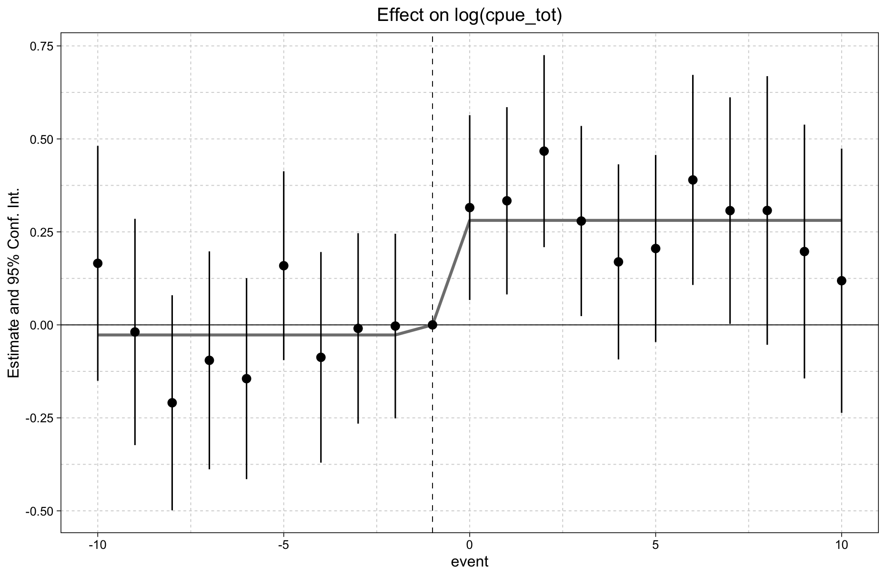
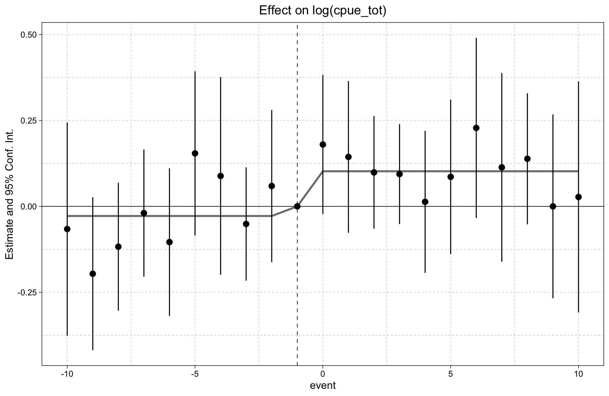

# Data and code for: "Evidence of Spillover Benefits from Large-Scale Marine Protected Areas to Purse Seine Fisheries"

[](https://doi.org/10.5281/zenodo.14207429)

# Reproducing the healdine results

## To reproduce Table 1, Panel A, Column 1 (The "naive" regression):
```
# Load data
annual_panel <- readRDS(file = ("data/processed/annual_full_estimation_panel.rds"))

# Run regression model for purse seine only
T1PAC1 <- lm(log(cpue_tot) ~ post + near + post:near,
    data = annual_panel[annual_panel$gear == "purse_seine", ])
  
# Summary of the model
summary(T1PAC1)

# Call:
# lm(formula = log(cpue_tot) ~ post + near + post:near, data = annual_panel[annual_panel$gear == 
#     "purse_seine", ])
# 
# Residuals:
#     Min      1Q  Median      3Q     Max 
# -5.2555 -0.6552  0.1519  0.8416  3.3108 
# 
# Coefficients:
#             Estimate Std. Error t value Pr(>|t|)    
# (Intercept)  2.63691    0.02225 118.533  < 2e-16 ***
# post         0.11422    0.03048   3.748 0.000179 ***
# near        -0.31507    0.03308  -9.526  < 2e-16 ***
# post:near    0.31984    0.04642   6.890 5.91e-12 ***
# ---
# Signif. codes:  0 ‘***’ 0.001 ‘**’ 0.01 ‘*’ 0.05 ‘.’ 0.1 ‘ ’ 1
# 
# Residual standard error: 1.171 on 10403 degrees of freedom
# Multiple R-squared:  0.02049,	Adjusted R-squared:  0.02021 
# F-statistic: 72.54 on 3 and 10403 DF,  p-value: < 2.2e-16
```

## To reproduce Table 1, Panel B, Column 4 (The "preferred"" specification):
```
if(!require("fixest")){install.packages("fixest")} # Install if not installed
library(fixest)

# Load data
most_relevant_panel <- readRDS(file = "data/processed/annual_relevant_mpa_gears_estimation_panel.rds")

# Run regression model for purse seine only
T1PBC4 <- feols(log(cpue_tot) ~ post + near + post:near | id + flag + wdpaid ^ year,
                 panel.id = ~id + year,
                 data = most_relevant_panel,
                 subset = ~gear == "purse_seine",
                 vcov = conley(cutoff = 200))

# Summary of the model
summary(T1PBC4)

# OLS estimation, Dep. Var.: log(cpue_tot)
# Observations: 10,273
# Subset: gear == "purse_seine"
# Fixed-effects: id: 532,  flag: 29,  wdpaid^year: 108
# Standard-errors: Conley (200km) 
#            Estimate   Std. Error      t value Pr(>|t|)    
# post      -0.024065 27497.864266 -0.000000875 0.999999    
# near      -2.682449 26555.889182 -0.000101011 0.999919    
# post:near  0.117201     0.056995  2.056347239 0.039775 *  
# ---
# Signif. codes:  0 '***' 0.001 '**' 0.01 '*' 0.05 '.' 0.1 ' ' 1
# RMSE: 0.772203     Adj. R2: 0.545907
#                  Within R2: 0.001196
```

## To explore an event-study approach

```
if(!require("fixest")){install.packages("fixest")} # Install if not installed
if(!require("ggfixest")){install.packages("fixest")} # Install if not installed
library(fixest)
library(ggfixest)

# Load data
most_relevant_panel <- readRDS(file = "data/processed/annual_relevant_mpa_gears_estimation_panel.rds")

# First one with no fixed effects ----------------------------------------------
# Estimate the model
base <- feols(log(cpue_tot) ~ event_fct + near + i(event, near, -1),
              data = most_relevant_panel %>%
                mutate(event_fct = as.factor(event),
                       event_fct = fct_relevel(event_fct, "-1")), # The last year pre-enforcementis the reference year
              vcov = "iid",
              subset = ~gear == "purse_seine")
# Plot it
ggfixest::ggiplot(base, aggr_eff = "both")
```


```
# Now with full FE's -----------------------------------------------------------
# Fit the model
mod_fe <- feols(log(cpue_tot) ~ i(event, near, -1) | id + event + flag +  year ^ wdpaid,
                data = most_relevant_panel,
                vcov = vcov_conley(cutoff = 200),
                subset = ~gear == "purse_seine")
# Plot it
ggfixest::ggiplot(mod_fe, aggr_eff = "both")
```

